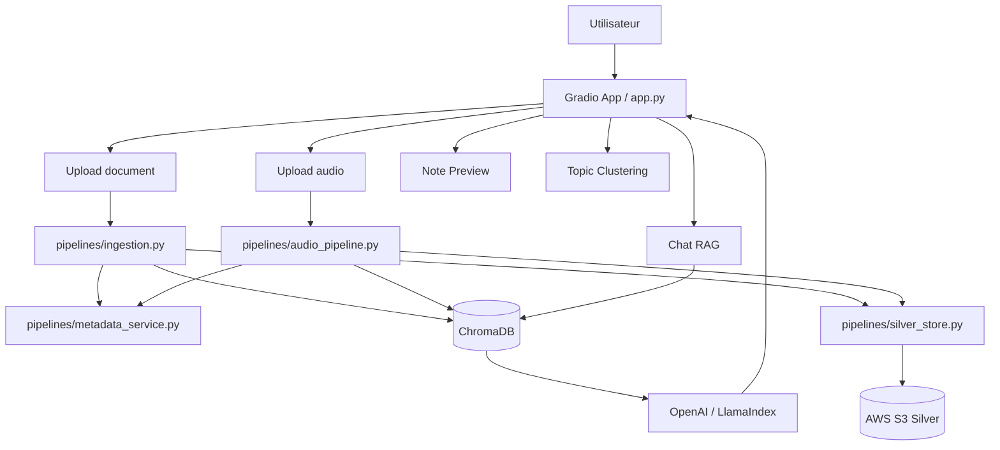
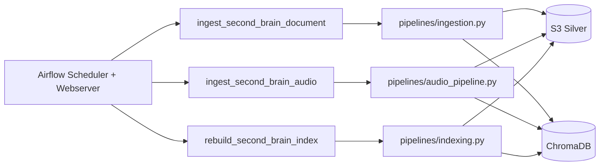
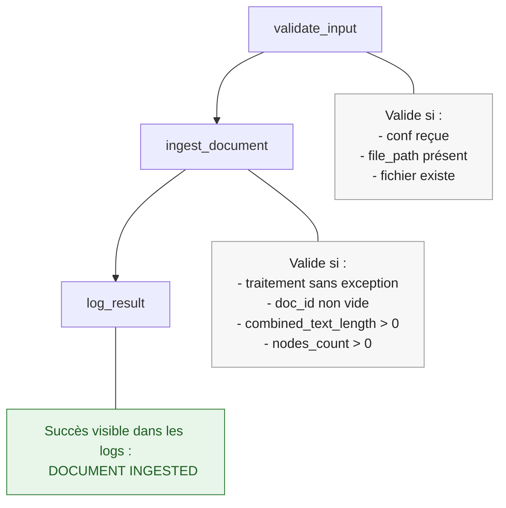
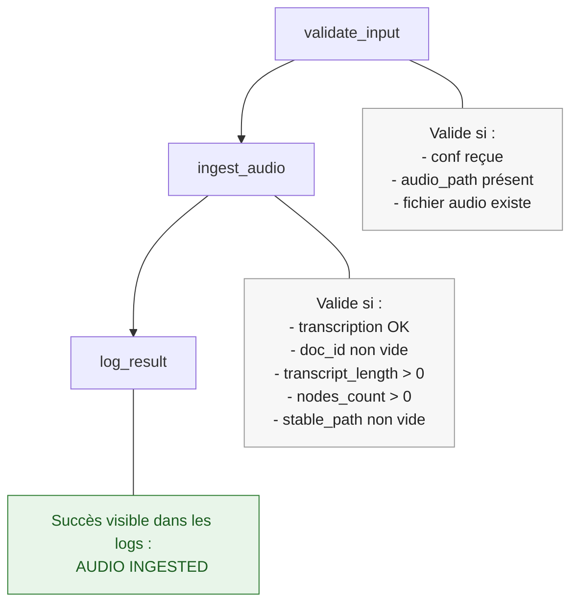
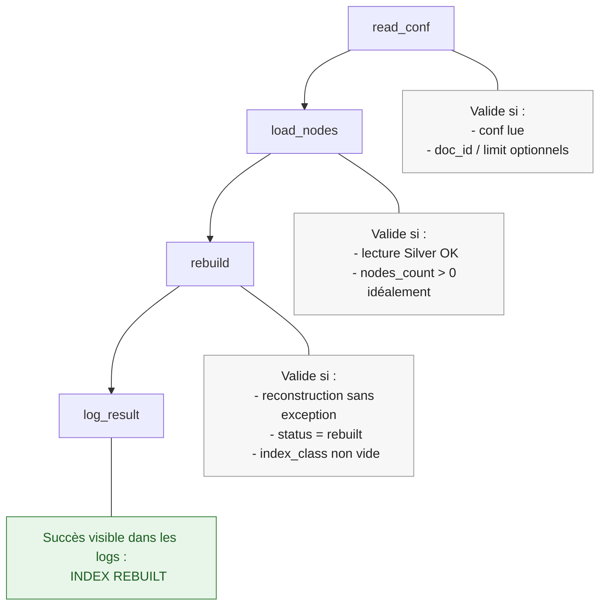
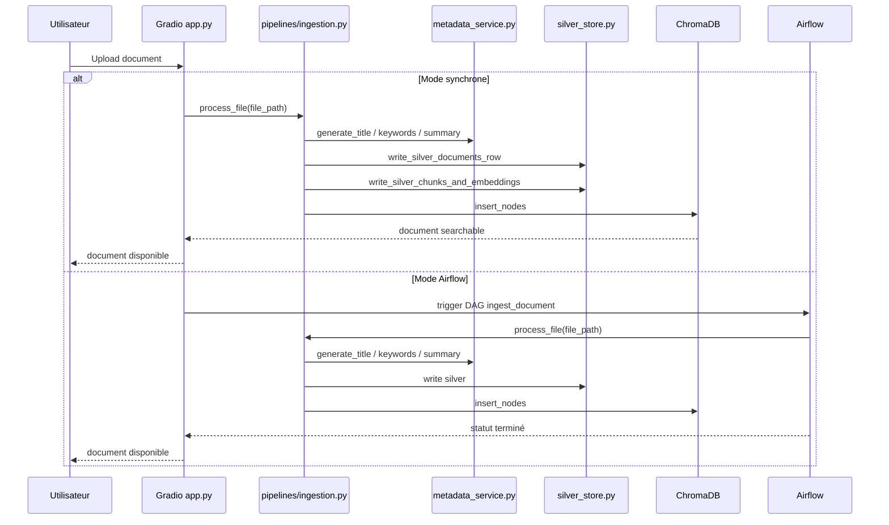

# 🧠 Second Brain — Architecture détaillée, logique métier et orchestration Airflow


Application de prise de notes intelligente avec **RAG**, **indexation vectorielle**, **stockage S3**, **transcription audio** et **orchestration Airflow**.

Ce README détaille **la logique métier**, **le rôle exact d’Airflow**, **les DAGs**, **les pipelines refactorés** et **la relation entre l’application Gradio et les jobs batch**.

---

## 1. Vision globale

Le projet a deux couches principales :

### A. Couche applicative interactive
C’est l’application **Gradio** (`app.py`) qui permet à l’utilisateur de :

- poser des questions à ses notes
- uploader des documents
- uploader de l’audio
- visualiser les notes
- explorer les topics
- interroger l’index vectoriel

Cette couche doit rester **rapide et interactive**.

### B. Couche pipeline / data engineering
C’est la couche **pipelines + Airflow** qui gère les traitements lourds et orchestrables :

- ingestion document
- ingestion audio
- extraction de métadonnées
- chunking
- embeddings
- écriture Silver sur S3
- reconstruction d’index
- réindexation planifiée

Cette couche doit être **fiable, relançable, observable et planifiable**.

---

## 2. Logique métier du projet

Le métier de l’application est le suivant :

### 2.1 Ingestion documentaire
Quand un utilisateur ajoute un document, le système :

1. lit le fichier
2. détecte son type
3. extrait son contenu texte
4. génère des métadonnées via LLM
5. découpe le contenu en chunks
6. calcule les embeddings
7. écrit les données structurées dans S3
8. indexe les chunks dans ChromaDB
9. rend le document interrogeable par le moteur RAG

### 2.2 Ingestion audio
Quand un utilisateur ajoute un audio, le système :

1. sauvegarde le fichier audio dans un chemin stable
2. l’envoie éventuellement dans S3 (raw)
3. le transcrit via OpenAI
4. crée un document texte à partir de la transcription
5. génère des métadonnées
6. crée les chunks
7. calcule les embeddings
8. écrit dans Silver
9. indexe dans ChromaDB

### 2.3 Recherche RAG
Quand l’utilisateur pose une question :

1. l’app choisit le périmètre de recherche
   - toutes les notes
   - une seule note
2. l’app interroge l’index vectoriel
3. les chunks pertinents sont récupérés
4. le moteur RAG construit une réponse
5. la réponse est affichée dans Gradio

### 2.4 Catégorisation / Topics
Le système peut aussi :

1. récupérer les métadonnées des notes
2. générer des embeddings de notes
3. faire du clustering
4. générer un nom de topic par cluster

Cette partie est analytique, et peut elle aussi être déplacée plus tard dans Airflow.

---

## 3. Pourquoi Airflow dans ce projet

Airflow n’est **pas** utilisé pour l’interface Gradio ou le chat temps réel.

Airflow sert à exécuter **les traitements batch et orchestrables**, c’est-à-dire les étapes qui :

- prennent du temps
- peuvent échouer
- doivent être relancées
- doivent être schedulées
- doivent être tracées dans des logs
- doivent pouvoir être rejouées indépendamment de l’UI

### Airflow est utile ici pour :
- ingestion de gros documents
- ingestion audio longue
- rechargement d’index
- re-indexation nocturne
- backfill
- reprise après erreur
- monitoring des pipelines

### Airflow n’est pas utile ici pour :
- la réponse instantanée du chatbot
- les interactions directes utilisateur
- le rendu Gradio
- les événements UI temps réel

---

## 4. Séparation des responsabilités

## `app.py`
Responsable de :
- l’interface Gradio
- l’état applicatif
- le chat
- la visualisation
- le déclenchement des pipelines
- le rechargement des résultats

## `pipelines/silver_store.py`
Responsable de :
- l’upload raw vers S3
- l’écriture des tables Silver :
  - `silver/documents`
  - `silver/chunks`
  - `silver/embeddings`
- les helpers S3 / hash / storage options

## `pipelines/ingestion.py`
Responsable de :
- l’ingestion d’un document
- l’extraction de texte
- l’enrichissement métadonnées
- le chunking
- l’écriture Silver
- l’indexation dans ChromaDB

## `pipelines/audio_pipeline.py`
Responsable de :
- l’ingestion d’un fichier audio
- la transcription
- la transformation en document texte
- le chunking
- les embeddings
- l’écriture Silver
- l’indexation

## `pipelines/indexing.py`
Responsable de :
- la lecture des chunks depuis Silver
- la reconstruction d’un index
- le rebuild complet ou partiel

## `pipelines/metadata_service.py`
Responsable de :
- `generate_title`
- `generate_keywords`
- `generate_summary`

## `dags/*.py`
Responsables de :
- l’orchestration des pipelines
- le scheduling
- les retries
- les logs
- la supervision
- l’exécution hors UI

---

## 5. Architecture applicative détaillée



---

## 6. Architecture Airflow détaillée



---

## 7. Détail métier de chaque pipeline

### 7.1 Pipeline document

But métier : transformer un fichier utilisateur en ressource RAG exploitable.

### Étapes :
1. recevoir un `file_path`
2. déterminer le `doc_id`
3. détecter le type de source
4. uploader le raw éventuel dans S3
5. charger le document
6. injecter les métadonnées source
7. générer :
   - titre
   - mots-clés
   - résumé
8. exécuter le pipeline LlamaIndex de transformation
9. normaliser les métadonnées des nodes
10. construire le texte combiné
11. calculer le hash
12. écrire :
   - `silver/documents`
   - `silver/chunks`
   - `silver/embeddings`
13. insérer les nodes dans ChromaDB
14. renvoyer un objet métier `IngestionResult`

### Résultat métier :
Le document devient :
- stocké en Silver
- searchable
- utilisable dans le chat
- visible dans l’UI

---

### 7.2 Pipeline audio

But métier : transformer un audio brut en document interrogeable par le moteur RAG.

### Étapes :
1. recevoir un `audio_path`
2. stabiliser le chemin du fichier
3. uploader l’audio brut dans S3
4. transcrire via OpenAI
5. créer un `Document`
6. générer métadonnées
7. chunker le texte transcrit
8. calculer les embeddings
9. écrire en Silver
10. indexer dans ChromaDB
11. renvoyer un objet `AudioIngestionResult`

### Résultat métier :
L’audio devient :
- texte interrogeable
- note searchable
- source disponible dans les vues UI

---

### 7.3 Pipeline de rebuild index

But métier : reconstruire l’index à partir de la couche Silver, sans repasser par toute l’UI.

### Étapes :
1. lire les chunks depuis S3
2. reconstruire des `TextNode`
3. recréer un `VectorStoreIndex`
4. republier ou remplacer l’index local

### Cas d’usage :
- corruption locale de l’index
- redémarrage d’environnement
- rechargement d’un document précis
- maintenance planifiée
- rattrapage batch

---

## 8. Détail des DAGs

### 8.1 `ingest_second_brain_document`
Rôle : exécuter le pipeline document de bout en bout.


### Entrée :
```json
{
  "file_path": "/absolute/path/to/document.pdf"
}
```

### Logique :
- valide le chemin d’entrée
- construit le runtime LLM / embeddings / Chroma / pipeline
- appelle `process_file(...)`
- log le résultat

### Usage :
- ingestion manuelle d’un document
- ingestion déclenchée par un autre système
- réintégration d’un document

---

### 8.2 `ingest_second_brain_audio`
Rôle : exécuter le pipeline audio de bout en bout.

### Entrée :
```json
{
  "audio_path": "/absolute/path/to/audio.mp3"
}
```

### Logique :
- valide le chemin
- prépare le runtime
- appelle `add_audio_file_db(...)` refactoré
- log le résultat

### Usage :
- transcription batch
- ingestion de réunions
- traitement différé d’audios

---

### 8.3 `rebuild_second_brain_index`
Rôle : reconstruire tout ou partie de l’index depuis Silver.

### Entrée optionnelle :
```json
{
  "doc_id": "mon_document.pdf",
  "limit": 100
}
```

### Logique :
- lit la config
- charge les nodes depuis Silver
- reconstruit l’index
- log le statut

### Usage :
- job nocturne
- maintenance
- reprise après incident
- reconstruction ciblée

---

## 9. Flux entre l’application et Airflow

Il y a deux modes de fonctionnement possibles.

### Mode A — synchrone dans Gradio
L’upload déclenche directement le pipeline Python dans `app.py`.

Avantages :
- simple
- immédiat
- pratique en local

Inconvénients :
- peu observable
- peu robuste sur gros fichiers
- pas idéal en production

### Mode B — orchestré par Airflow
L’upload dans l’app peut :
1. sauvegarder le fichier
2. déclencher un DAG Airflow
3. afficher un statut "processing"
4. recharger les résultats quand le DAG est fini

Avantages :
- retries
- logs
- monitoring
- scheduling
- séparation UI / batch

Inconvénients :
- plus complexe
- nécessite Airflow opérationnel

---

## 10. Intégration recommandée dans votre app

### En local / démo
Utiliser :
- `python app.py`
- Airflow 

### En mode structuré / portfolio / prod
Utiliser :
- Gradio pour l’UI
- Airflow pour :
  - ingestion documents
  - ingestion audio
  - rebuild index
  - réindexation planifiée

### Stratégie conseillée
1. Gradio reste le front
2. les pipelines restent dans `pipelines/*.py`
3. Airflow orchestre les traitements longs
4. ChromaDB reste le moteur d’indexation
5. S3 reste la couche Silver de vérité

---

## 11. Diagramme détaillé du cycle de vie d’un document



---

## 12. Arborescence projet recommandée

```text
second-brain/
├── app.py
├── requirements.txt
├── README.md
├── .env
├── chroma_db/
├── data/
├── dags/
│   ├── ingest_document_dag.py
│   ├── ingest_audio_dag.py
│   └── rebuild_index_dag.py
├── pipelines/
│   ├── __init__.py
│   ├── silver_store.py
│   ├── ingestion.py
│   ├── audio_pipeline.py
│   ├── indexing.py
│   └── metadata_service.py
```

---

## 13. Lancer l’application

```bash
python app.py
```

Application :
```text
http://localhost:7860
```

---

## 14. Lancer Airflow

### Linux / macOS
```bash
export AIRFLOW_HOME=$(pwd)/airflow_home
export PYTHONPATH=$(pwd)
```

### Windows PowerShell
```powershell
$env:AIRFLOW_HOME = "$(Get-Location)\airflow_home"
$env:PYTHONPATH = (Get-Location).Path
```

### Initialisation
```bash
airflow db init
```

### Création user admin
```bash
airflow users create --username admin --firstname Admin --lastname User --role Admin --email admin@example.com --password admin
```

### Lancement
Terminal 1 :
```bash
airflow scheduler
```

Terminal 2 :
```bash
airflow webserver --port 8080
```

UI Airflow :
```text
http://localhost:8080
```

---

## 15. Déclenchement des DAGs

### Ingestion document
```json
{
  "file_path": "/absolute/path/to/document.pdf"
}
```

### Ingestion audio
```json
{
  "audio_path": "/absolute/path/to/audio.mp3"
}
```

### Rebuild index
```json
{
  "doc_id": "document.pdf",
  "limit": 100
}
```

---

## 16. Lecture simple de l’architecture

### La vérité métier du système est répartie ainsi :
- **S3 Silver** = persistance analytique structurée
- **ChromaDB** = moteur de recherche vectorielle
- **Gradio** = interaction utilisateur
- **Airflow** = exécution et orchestration batch
- **pipelines** = logique métier modulaire
- **metadata_service** = enrichissement LLM

---

## 17. Roadmap technique

Améliorations possibles :
- déclenchement Airflow depuis Gradio via API
- table de suivi des jobs
- statut de traitement dans l’UI
- Docker Compose avec Gradio + Airflow + Chroma
- monitoring centralisé
- séparation bronze / silver / gold
- pipeline topics dans Airflow

---

## 18. Résumé

### `app.py`
sert à faire tourner l’application et l’expérience utilisateur.

### `pipelines/*.py`
servent à encapsuler la logique métier réutilisable.

### `dags/*.py`
servent à orchestrer ces pipelines dans Airflow.

### Airflow
sert à exécuter, planifier, surveiller et relancer les traitements lourds.

### ChromaDB
sert à rendre les documents interrogeables par similarité vectorielle.

### S3 Silver
sert à stocker les données intermédiaires et reconstruites, indépendamment de l’UI.

